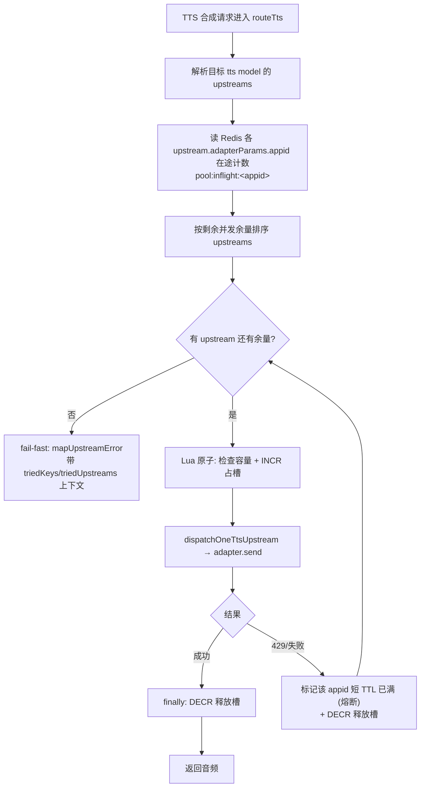
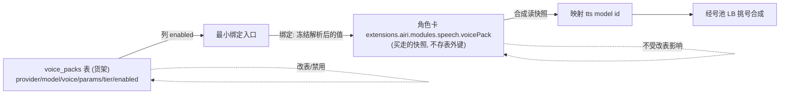

# feat: TTS 号池负载均衡 + Voice Pack 音色系统

## Summary

一个计划两块，号池负载均衡排最前。先做 TTS 号池容量感知负载均衡（Redis 在途计数 + 容量感知路由 + 429 反哺 + 监控），让「一账号 10 app × 10 并发 = 100 并发」的理论容量真正用满；再做 Voice Pack 音色系统（服务端 `voice_packs` 表 + admin CRUD API + 角色卡冻结快照 + 合成读快照）。两块解耦：Voice Pack 只 pin 一个 tts model id，那个 model 的 upstreams 即号池。

## Problem Frame

号池侧：上游按 `app_id` 限并发（典型 10），扩额贵，绕法是一账号开多 app 凑并发。但现有 `routeTts` 的 `createKeyRotator`（`apps/server/src/services/.../router.ts:429`）是无状态盲轮转，每请求新建、纯按 config 顺序遍历；upstream 主循环（`router.ts:559`）也是固定顺序，永远先打满第一个再降级。结果是 100 并发理论容量用不满，且单号越界触发 429。这层不是负载均衡，是 failover 顺序表。

音色侧：当前音色是全局 localStorage 状态（`packages/stage-ui/src/stores/modules/speech.ts:32-35`），不绑角色卡、不是快照。voice catalog per-model，上游变化时已选音色会被动漂移。用户还被迫理解 provider 拓扑。

详见 origin 需求文档（`docs/brainstorms/2026-05-30-voice-pack-requirements.md`）的 Problem Frame 与 Key Decisions。

## Key Technical Decisions

- **并发计数放 Redis，按多副本设计。** 代码已有多副本假设（`apps/server/src/.../gauges/active-sessions.ts:23-26` 明确 cluster-wide gauge、必须 `avg()` 不 `sum()`；`otel/index.ts:76-90` 选 ObservableGauge 避免多副本重复计数）。进程内内存会让各副本各算、号池超卖。复用 flux meter 的 Lua 原子模式（`flux-meter.ts:23-31` INCRBY+EXPIRE+条件 DECRBY），TTL 兜底防崩溃副本永久占槽。(see origin: docs/brainstorms/2026-05-30-voice-pack-requirements.md R1/R2)

- **建模：一个 app_id = 一个 upstream。** volcengine 的 `appid` 取自 `ctx.adapterParams.appid`（`adapters/tts/volcengine.ts:49-51`，upstream 级），token 走 `keys[].ciphertext`。要表达 10 个 app_id 就配 10 个 `upstreams[]`（每个一个 appid + 它的 token）。这样 appid 已在路由层可见（`upstream.adapterParams.appid`），并发计数 key 自然是 `pool:inflight:<appid>`，且直接落在 routeTts 已有的 upstream 遍历上。否决「appid 下沉到 key 级」方案：要改 adapter 取值位置且注入面更大。

- **容量感知做在 routeTts 路由层，不加 route gate。** 「哪个 app_id 还有余量」是路由决策不是请求准入。现有 `ttsMeter.assertCanAfford`（计费余额）和 `ttsGuard`（配置存在性，`config-guard.ts:12`）都不是并发 gate，不复用它们做并发。全池满 → 走现有 exhaustion fail-fast（`router.ts:591-616` `mapUpstreamError`），不静默降级。

- **429 是安全网不是主信号。** `fallbackHttpCodes` 默认含 429（`router.ts:549`），现状是上游回 429 才被动切号。主动层（Redis 计数）在派发前就跳过满号；429 仍作兜底，且收到 429 时把该 appid 标记短 TTL「已满」反哺主动层，避免继续往坏号派（对应 origin R6 坏号退避）。

- **监控复用现有 OTel metrics，零新基建。** counter 加进 `GatewayMetrics`（`otel/index.ts:202-244`，已有 fallbackCount/upstreamErrors/keyExhaustedCount，router 里已打点）；池水位 gauge 仿 `gauges/active-sessions.ts:42-102` 把数据源从 Postgres 换 Redis。Langfuse 是 trace 不碰。

- **Voice Pack library 是服务端 `voice_packs` 表（复数），管理员策展。** 本轮只装云提供商音色 = `provider + model + voice + 参数覆盖`，覆盖标准 voice 与云端克隆 model id 两类。参数覆盖是 pack 身份的一部分（同 voice 不同参数 = 不同 pack）。未来参考音频落 `voice_pack_reference` 子表（FK → voice_packs），`voice_packs` 永远是唯一身份/市场/计费实体，本轮不建子表只记形状。

- **绑定冻结解析后的值，不存表外键。** 角色卡冻结 `provider/model/voice/params/tier + pin 的 tts model id` 进 `extensions.airi.modules.speech.voicePack`（扩 `airi-card.ts:173-215` 现有 speech 快照点）。存外键会让改表连带改卡，回到漂移。`resolveAiriExtension`（`airi-card.ts:161`）处理字段缺失，不加 backward-compat guard。

- **tier 本轮是展示 + 数据。** `voice_packs` 一列，复用 `tts-billing-tiers.md` 的 lite/standard/pro/premium 命名，冻进快照。本轮只有单 meter（`FLUX_PER_1K_CHARS_TTS`），四档拆分属 billing 独立线，「按最高档取价」暂无真实差价效果。

## High-Level Technical Design

### 号池容量感知路由（Phase A 核心）

### Voice Pack 身份 → 冻结快照 → 合成（source-of-truth）

## Implementation Units

### Phase A — TTS 号池负载均衡（最高优先）

### U1. Redis 在途并发计数账本

- **Goal:** 提供「按 appid 原子占用/释放一个并发槽」的 Redis 账本，作为容量感知路由的底层。
- **Requirements:** R1, R2, R3（origin）
- **Dependencies:** 无
- **Files:**
  - `apps/server/src/services/tts/concurrency-ledger.ts`（新建，命名待 review，避免 `manager`/`pool` 泛词；候选 `concurrency-ledger` / `inflight-slots`）
  - `apps/server/src/services/tts/concurrency-ledger.test.ts`（新建）
- **Approach:** 仿 `flux-meter.ts:23-31` 的 Lua 原子脚本：`tryAcquire(appId, maxConcurrency)` = Lua 内 `GET pool:inflight:<appId>`，未超上限则 `INCR` + `EXPIRE`(短 TTL 防泄漏) 返回成功，超上限返回失败；`release(appId)` = `DECR`(下限 0)。另出 `markSaturated(appId, ttl)`（429 熔断用，set 一个 `pool:saturated:<appId>` 短 TTL flag）与 `currentInflight(appId)` 读数。复用现有 Redis client injeca（与 `createFluxMeter` 同源，`app.ts:616` 附近）。
- **Patterns to follow:** `apps/server/src/services/.../flux-meter.ts:23-31`（Lua INCRBY+EXPIRE+条件 DECRBY）、:106（`redis.eval` 用法）、:18（TTL survives 注释思路）。
- **Test scenarios:**
  - tryAcquire 在未达上限时 INCR 并返回成功；达上限返回失败且不 INCR。
  - tryAcquire + release 配对后计数回到原值。
  - 并发 N 个 tryAcquire 对同一 appid（用 Lua 原子性）：成功数不超过 maxConcurrency（check-then-incr 无竞态）。
  - release 在计数为 0 时不变成负数。
  - markSaturated 后 saturated flag 存在且在 TTL 后消失（用短 TTL + 等待或 fakeable clock；若不可控用最小真实 TTL 断言存在性）。
  - 槽未释放时 TTL 到期后计数自动清零（防崩溃副本占槽）。
- **Verification:** 单测覆盖 acquire/release/saturate 的原子性与边界；Redis 用测试实例或 ioredis-mock 等价物（按 server 现有测试惯例）。

### U2. 容量感知 upstream 路由

- **Goal:** 把 `routeTts` 的固定顺序 upstream 遍历换成按 appid 剩余并发余量挑选，并在派发前后占/放槽。
- **Requirements:** R1, R4, R7（origin）
- **Dependencies:** U1
- **Files:**
  - `apps/server/src/services/.../router.ts`（改 `routeTts` upstream 选择 :559、`dispatchOneTtsUpstream` 槽位获取/释放 :413-534）
  - `apps/server/src/services/.../router.test.ts`（新增/扩展号池路由用例）
- **Approach:** 路由前查 U1 账本各 `upstream.adapterParams.appid` 的在途数与 saturated flag，过滤掉满号/熔断号，按剩余余量排序后遍历（替代 :559 的 `for i in 0..length` 固定顺序）。进入 `adapter.send`（:450）前 `tryAcquire`；失败（该号刚好满）则跳到下一个候选。槽释放放 `dispatchOneTtsUpstream` 已有的 finally（:527-529，与 `key.plaintext.fill(0)` 同块）。所有候选都满/耗尽 → 现有 exhaustion 路径 `mapUpstreamError`（:591-616）fail-fast。key 级 `createKeyRotator` 不动（appid 在 upstream 级）。
- **Patterns to follow:** `router.ts:559`（upstream 遍历）、:527-529（finally 释放点）、:591-616（exhaustion fail-fast）、`mapUpstreamError`（`error-mapping.ts:62`）。
- **Test scenarios:**
  - Covers AE1. 池内多 upstream（多 appid）各上限 10，并发 50 路被摊到多个号（每号约均匀），不是打满前几个再溢出。
  - 单个 upstream（appid）满时路由跳过它选下一个有余量的。
  - 全池满时 fail-fast 抛带上下文错误（triedUpstreams 等），不静默挂起、不静默降级。
  - 成功路径在 finally 释放槽；异常路径也释放槽（不泄漏）。
  - 只有一个 upstream 且未满时行为与改造前一致（不回归）。
- **Verification:** router 单测用 mock adapter + mock/test Redis 断言「派发分布跨 appid」「满号被跳过」「耗尽 fail-fast」「槽必释放」。

### U3. 429 反哺主动层（reactive 熔断）

- **Goal:** 上游回 429（app_id 越界）时把该 appid 标记短 TTL「已满」，让主动路由一段时间内不再选它。
- **Requirements:** R6（origin）
- **Dependencies:** U1, U2
- **Files:**
  - `apps/server/src/services/.../router.ts`（429 fallback 分支 :506-524 处调用 `markSaturated`）
  - `apps/server/src/services/.../router.test.ts`（扩展）
- **Approach:** 现有 fallback 判断（:518 `fallbackHttpCodes.includes(rawStatus)`）命中 429 时，除继续切号外，调用 U1 的 `markSaturated(appid, shortTtl)`。U2 的候选过滤已读 saturated flag，自然跳过。区分 429（并发/限流，熔断该号）与其它 fallback 码（如 500/502，按现有逻辑切号但不必熔断），避免把临时网络错误误判成号满。
- **Patterns to follow:** `router.ts:506-524`（fallback 分支与状态判断）、`fallbackHttpCodes`（:549）。
- **Test scenarios:**
  - Covers AE3. 某 appid 连续 429 → 被 markSaturated → 后续路由窗口期内不再选它，流量转健康号。
  - 熔断 TTL 过后该 appid 重新可被选中。
  - 非 429 的 fallback 码（如 502）触发切号但不 markSaturated。
  - 全池都被熔断时 fail-fast，不静默挂起。
- **Verification:** 单测断言「429 后该号进入 saturated 窗口被跳过」「TTL 后恢复」「非 429 不熔断」。

### U4. 号池监控指标

- **Goal:** 暴露号池水位与饱和指标到现有 OTel metrics pipeline。
- **Requirements:** R5（origin）
- **Dependencies:** U1
- **Files:**
  - `apps/server/src/.../otel/index.ts`（`GatewayMetrics` 接口 :202-244 加字段 + 实例化 :442-458）
  - `apps/server/src/.../gauges/tts-pool.ts`（新建，仿 active-sessions gauge）
  - `apps/server/src/app.ts`（注册 gauge，仿 :695-712 `registerActiveSessionsGauge`）
  - `apps/server/src/.../gauges/tts-pool.test.ts`（新建）
- **Approach:** counter：在 `GatewayMetrics` 加 `poolSaturationCount`（429-as-full 次数）、`slotAcquireFailCount`（主动层判满拒派次数），打点位置复用 router 现有 counter 打点处（U2/U3 内）。gauge：池水位 ObservableGauge，回调读 Redis 各 `pool:inflight:<appid>`，仿 `gauges/active-sessions.ts:42-102`（10s 缓存 + in-flight 去重 + 失败不 observe 让 staleness 报警）。给 gauge 加 `app_id` label。
- **Patterns to follow:** `otel/index.ts:202-244`（GatewayMetrics 定义与打点）、`gauges/active-sessions.ts:42-102`（cluster-wide ObservableGauge 模板）、`app.ts:695-712`（注册）。
- **Test scenarios:**
  - gauge 回调读 Redis 多个 appid 在途数并 observe 对应值 + 正确 label。
  - Redis 读失败时回调不 observe（让 Prometheus staleness 生效），不抛崩回调。
  - 10s 缓存命中时不重复打 Redis；in-flight 去重不并发重复读。
  - counter 在 markSaturated / 判满拒派时各 +1。
- **Verification:** 单测覆盖 gauge 回调读数/失败/缓存与 counter 自增；多副本语义在注释与 dashboard 说明（avg 不 sum）。

### Phase B — Voice Pack 表与管理

### U5. `voice_packs` 表 + 迁移

- **Goal:** 建 `voice_packs` 表存云提供商音色定义。
- **Requirements:** R8, R9, R15（origin）
- **Dependencies:** 无（可与 Phase A 并行）
- **Files:**
  - server 端 DB schema / migration（路径按现有迁移工具，见 Approach 待确认项）
  - 对应 schema/migration 测试或快照
- **Approach:** 表列：`id`、`name`、`provider`、`model`、`voice_id`、`params`(jsonb：pitch/rate/volume 等)、`tier`(picklist lite/standard/pro/premium)、`enabled`(bool 软禁用)、`created_at`/`updated_at`。参数覆盖入 jsonb（同 voice 不同参数 = 不同行 = 不同 pack）。**待确认（实现期）：** apps/server 的迁移工具与既有表定义位置（cloud-sync 设计提到 `characters` 表，沿用同一 ORM/迁移机制）；确认后按现有 migration 约定落表。
- **Patterns to follow:** 现有 server 表/迁移定义（与 `characters` 表同机制）；列命名贴近域、复数表名（`voice_packs`）。
- **Test scenarios:**
  - 迁移可正向应用建表，列与约束符合预期（enabled 默认值、tier 枚举约束、jsonb 默认）。
  - Test expectation: 以迁移/schema 校验为主；无业务逻辑分支。
- **Verification:** 迁移在测试库正向应用成功，schema 与计划列一致。

### U6. voice_packs valibot schema + 域服务

- **Goal:** 提供 voice_packs 的校验 schema 与 CRUD 域服务（含 list-enabled）。
- **Requirements:** R8, R9, R10, R11（origin）
- **Dependencies:** U5
- **Files:**
  - `apps/server/src/services/domain/voice-packs/`（新建域服务 + valibot schema）
  - 对应 `*.test.ts`
- **Approach:** valibot schema 定义 pack 形状（provider/model/voice/params/tier/enabled），在外部边界（API 入参、DB 行）各做一次校验，内部不重复防御。域服务出 `create/update/disable/list/listEnabled`，injeca 注入 DB（仅 DB 边界用 DI，不建 pass-through service）。复用现有 admin router-config 服务的组织方式（`services/domain/admin/router-config`）。
- **Patterns to follow:** `apps/server/src/services/adapters/config-kv.ts:25-153`（valibot 用法）、`services/domain/admin/router-config`（域服务 + injeca）。
- **Test scenarios:**
  - create 持久化一行并通过 schema 校验；非法 tier / 缺字段被 schema 拒绝。
  - update 改 params 产生新形状；不影响其它行。
  - disable 置 enabled=false，行仍在。
  - listEnabled 只返回 enabled=true 的行；list 返回全部。
  - 参数覆盖：同 provider/model/voice 不同 params 是两条独立记录。
- **Verification:** 域服务单测覆盖 CRUD + listEnabled + schema 边界；DB 用测试库或等价。

### U7. admin CRUD HTTP API

- **Goal:** 暴露 admin 路由：新增 / 编辑 / 禁用 / 列出 voice pack。
- **Requirements:** R10, R11（origin）
- **Dependencies:** U6
- **Files:**
  - `apps/server/src/routes/admin/voice-packs/`（新建路由）
  - 路由挂载处（仿现有 admin config 路由注册）
  - 对应 `*.test.ts`
- **Approach:** 复用现有 admin 鉴权/路由 pattern（`apps/server/src/routes/admin/config/`），路由调 U6 域服务。入参 valibot 校验（外部边界）。列表接口供最小绑定入口读 enabled pack。
- **Patterns to follow:** `apps/server/src/routes/admin/config/router/index.ts`（admin 路由 + body schema）、injeca 服务注入（`app.ts:648` adminRouterConfig）。
- **Test scenarios:**
  - POST 新增返回创建的 pack；非法 body 返回 400（schema 拒绝）。
  - PATCH 编辑、POST/PATCH 禁用置 enabled=false。
  - GET 列出（admin 看全部；enabled 过滤接口供客户端）。
  - 未授权请求被 admin 鉴权拒绝（复用现有 admin guard）。
- **Verification:** 路由集成测试（Hono test client）断言状态码、鉴权、与域服务交互。

### Phase C — 角色卡绑定与合成

### U8. 角色卡 Voice Pack 快照契约

- **Goal:** 在角色卡 speech 扩展里定义冻结快照字段，写入即冻结、读取兼容缺失。
- **Requirements:** R12, R15（origin）
- **Dependencies:** U6（快照形状需与 pack 解析值对齐）
- **Files:**
  - `packages/stage-ui/src/stores/modules/airi-card.ts`（扩 `AiriExtension.modules.speech` 加 `voicePack` 子对象 :19-74；写入 :173-215；读取 `resolveAiriExtension` :161）
  - `packages/stage-ui/src/stores/modules/airi-card.test.ts`（新增/扩展）
- **Approach:** `voicePack` 快照 = `{ packId, name, provider, model, voiceId, params, tier, ttsModelId }`（解析后的值，非表外键）。绑定写入这个对象；`resolveAiriExtension` 对缺失返回 undefined 分支（不加 backward-compat guard，缺失即「未绑定 Voice Pack」走旧 speech 字段）。注意与整卡 LWW 云同步（`docs/ai/context/plans/2026-05-09-character-cards-cloud-sync-design.md`）对齐：快照随整卡同步，schema 改动不破坏 LWW。
- **Patterns to follow:** `airi-card.ts:161-215`（speech 快照读写）、`resolveAiriExtension`（:161 缺失兼容）、`packages/ccc/src/export/types/extensions.ts:1`（开放 extensions）。
- **Test scenarios:**
  - 写入 voicePack 快照后读回值一致。
  - Covers AE4. 写入后再「改 library 值」（模拟另一份 pack 定义）不改变已写入快照（快照是值拷贝，无表引用）。
  - 卡内无 voicePack 字段时 resolveAiriExtension 返回未绑定分支，不抛错（旧卡兼容靠默认路径非 guard）。
  - 快照含 ttsModelId，供合成映射。
- **Verification:** store 单测断言快照值拷贝语义、缺失兼容、字段完整。

### U9. 最小绑定入口

- **Goal:** 在现有 speech 设置页让用户选一个 enabled Voice Pack，触发冻结快照写入当前角色卡。
- **Requirements:** R11, R14（origin）
- **Dependencies:** U7, U8
- **Files:**
  - `packages/stage-pages/src/pages/settings/modules/speech.vue`（加 Voice Pack 选择 → 调绑定）
  - `packages/stage-ui/src/stores/modules/`（绑定动作：读 listEnabled API → 冻结快照入卡，复用 speech store / airi-card store）
  - i18n key 加到 `packages/i18n`（注意 `@` 转义 `{'@'}`）
  - 对应 `*.test.ts`
- **Approach:** 复用 `VoiceCardManySelect` / speech.vue 现有结构（`stage-pages` 共享页，双端生效），列 enabled pack（带 tier badge 展示，复用属性 chips 落点 `voice-card.vue:167-180`）。选中即调 U8 的绑定动作冻结快照。本轮不做独立市场浏览页。tier 仅展示。
- **Patterns to follow:** `packages/stage-pages/src/pages/settings/modules/speech.vue`（共享页 + `<route lang="yaml"> layout: settings`）、`components/menu/voice-card.vue`（badge/chips）、`use-modules-list.ts:59-64`（模块入口）。
- **Test scenarios:**
  - 选中一个 enabled pack → 角色卡写入对应冻结快照（断言 store 调用与快照值）。
  - 列表只展示 enabled pack。
  - tier badge 正确渲染（展示层）。
  - 双端共享页：组件在 stage-web/tamagotchi 同一实现（不双写）。
- **Verification:** 组件/store 单测 + 真实浏览器实测绑定流程（screenshot/console，前端改动按 CLAUDE.md 需浏览器证据）。

### U10. 合成读快照 + 参数应用

- **Goal:** 合成时读角色卡冻结快照，映射 tts model 并应用参数；不支持的参数 fail-fast。
- **Requirements:** R12, R13（origin）
- **Dependencies:** U8；（路由经 U2 号池 LB）
- **Files:**
  - `packages/stage-ui/src/stores/modules/speech.ts`（读快照构造合成请求；参数 → `generateSSML` prosody :298-338 或 adapter options）
  - server 合成入参处理（`apps/server/src/routes/openai/v1/index.ts:489-614` handleTTS，参数透传/校验）
  - 对应 `*.test.ts`
- **Approach:** 绑定卡合成时读 `voicePack` 快照，用 `ttsModelId` 作为 model（经服务端 routeTts → 号池 LB）。参数覆盖：SSML-capable provider 走 `generateSSML`（pitch/rate/volume）；其它走 adapter `speed`/`extraOptions`。目标后端无法应用某参数时 fail-fast 报带上下文错误（可 grep），不静默丢参数（符合禁止静默降级）。
- **Patterns to follow:** `speech.ts:280-296`（合成入口）、:298-338（generateSSML prosody）、`adapters/tts/types.ts:12-30`（TtsInput speed/extraOptions）、`errorMessageFrom`（`speech.ts:113`）。
- **Test scenarios:**
  - 绑定卡合成用快照的 ttsModelId + voice + 参数构造请求。
  - SSML-capable provider 的 pitch/volume 进 SSML prosody。
  - Covers AE5. 目标后端不支持的参数 → fail-fast 抛带上下文错误，不静默出声丢参数。
  - 未绑定卡走旧 speech 字段路径（不回归）。
- **Verification:** 单测覆盖快照→请求构造、参数映射、不支持参数 fail-fast；触外部边界（合成）需一次真实合成命令/日志证据（按 CLAUDE.md Iron Law）。

## System-Wide Impact

- **TTS 路由层行为变更（U2/U3）影响所有走 routeTts 的 TTS 合成**，不止 Voice Pack。改造需保「单 upstream/未满」场景不回归。
- **多副本一致性**：并发计数与 gauge 是 cluster-wide，dashboard 必须 `avg()` 不 `sum()`；新增 gauge 沿用此约束并在注释写明。
- **角色卡 schema 变更（U8）进整卡 LWW 云同步**，需与 cloud-sync 设计对齐，避免破坏同步。
- **计费**：本轮 tier 不碰实际扣费；四档 meter 拆分是独立 billing 线，勿在本计划顺手改 meter。

## Scope Boundaries

### 本计划范围内
- Phase A 号池负载均衡（U1-U4）、Phase B Voice Pack 表与 admin API（U5-U7）、Phase C 绑定与合成（U8-U10）。

### Deferred for later（origin 已列）
- 参考音频整块（materialize、随机 roll、情绪标签）；未来 `voice_pack_reference` 子表，本轮只记形状不建表。
- emotion embedding 内容类型。
- 声音克隆 upload→clone API 流程（本轮只消费已克隆 model id）。
- 四档 meter 拆分（billing 独立线）。
- 用户侧精选市场浏览页（本轮只最小绑定入口）。
- Voice Pack 管理 UI 页面（本轮只 admin HTTP API）。
- 可分发市场（发布/下载/分享）。

### Deferred to Follow-Up Work（计划期发现，本轮不顺手做）
- 「排队等空位」语义（现框架无等待逻辑）：本轮全池满直接 fail-fast，不实现排队。
- key 级 appid 建模（appid 下沉到 key）：本轮用 app_id = upstream，不重构 schema 粒度。

## Risks & Dependencies

- **Redis 计数与上游实际并发不同步**：主动层估算可能偏差，靠 429 兜底 + 熔断反哺（U3）收敛；TTL 防泄漏。风险可控但需监控（U4）验证实际命中率。
- **迁移工具未确认（U5）**：实现期需先定位 apps/server 迁移机制（与 `characters` 表同源），再落表。
- **app_id 落位假设（建模）**：基于 volcengine `adapterParams.appid`（`volcengine.ts:49`）；若实际有 provider 把 app 凭据放别处，需在 U2 路由前确认 appid 提取统一。
- **云同步对齐（U8）**：快照 schema 改动需与 cloud-sync 设计联动，避免 LWW 整卡同步破坏。
- **`tts-billing-tiers.md` 不在本分支**：tier 命名来源文档当前在 main worktree 未提交，引用时同步。

## Sources & Research

- `apps/server/src/services/.../router.ts:413-617` — routeTts、dispatchOneTtsUpstream、createKeyRotator、upstream 遍历（号池 LB 改造点）、exhaustion fail-fast。
- `apps/server/src/services/.../flux-meter.ts:18, 23-31, 106` — Lua INCRBY+EXPIRE+条件 DECRBY + redis.eval（并发账本复用模式）。
- `apps/server/src/.../gauges/active-sessions.ts:23-26, 42-102` — cluster-wide ObservableGauge 模板 + 多副本 avg 约束。
- `apps/server/src/.../otel/index.ts:76-90, 202-244, 442-458` — GatewayMetrics、ObservableGauge 选型。
- `apps/server/src/services/adapters/tts/volcengine.ts:49-55, 90` — appid 取自 adapterParams、token 走 keyPlaintext。
- `apps/server/src/services/adapters/config-kv.ts:33-40, 57-61, 83-87, 118, 134` — keyEntry/ttsUpstream/ttsModel schema、FLUX_PER_1K_CHARS_TTS、DEFAULT_TTS_VOICES。
- `apps/server/src/routes/openai/v1/index.ts:489-642, 738, 759` — handleTTS、/audio/voices、ttsGuard、/speech 路由挂载。
- `apps/server/src/app.ts:616-632, 695-712` — ttsMeter（Redis）、registerActiveSessionsGauge。
- `apps/server/railway.toml:1-11` — Railway 部署（无 replicas 字段，副本数控制台侧）。
- `packages/stage-ui/src/stores/modules/airi-card.ts:19-74, 161-215` — speech 快照读写（冻结快照落点）。
- `packages/stage-ui/src/stores/modules/speech.ts:32-35, 280-296, 298-338` — 全局 voice 状态、合成入口、generateSSML。
- `packages/ccc/src/export/types/extensions.ts:1` — 开放 extensions。
- `docs/ai/context/tts-billing-tiers.md` — tier 命名来源。
- `docs/ai/context/plans/2026-05-09-character-cards-cloud-sync-design.md` — 整卡 LWW 云同步对齐。
