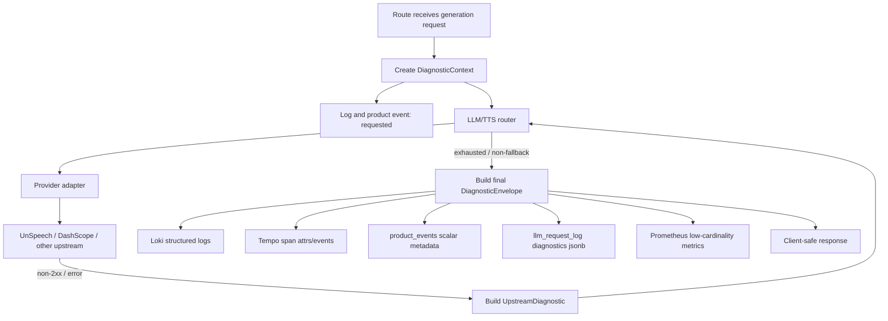
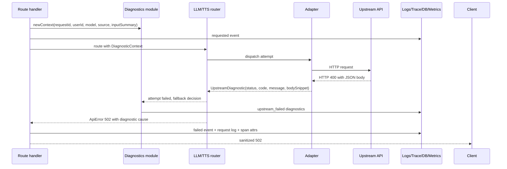

# feat: Full-flow observability diagnostics

## Summary

Add a shared server-side diagnostics layer for OpenAI-compatible chat, HTTP TTS, streaming TTS WebSocket, router attempts, upstream adapters, billing, request logs, product events, logs, traces, and metrics. The immediate acceptance sample is the CosyVoice incident where AIRI returned 502 while UnSpeech/DashScope returned 400, but the implementation should cover the full generation flow rather than only TTS errors.

## Problem Frame

During the TTS incident, Grafana showed a concentrated burst of `POST /api/v1/audio/speech` 502 responses for `alibaba/cosyvoice-v1` while Tempo exposed an internal `POST https://unspeech-production.up.railway.app/v1/audio/speech` span returning upstream HTTP 400. Product events recorded `speech_failed` with final `http_status: 502` and reason `BAD_GATEWAY`, but Loki did not contain structured fields such as upstream HTTP status, upstream provider, upstream error code, response body snippet, or request input snippet.

The result is an operational dead end: we can identify that one user repeatedly triggered the failure, but we cannot answer why DashScope returned 400 without replaying, guessing, or obtaining upstream-side logs. This plan turns each generation request into a correlated diagnostic record that survives across logs, traces, product events, and request logs.

---

## Requirements

**Correlation**

- R1. Every chat, HTTP TTS, and TTS WebSocket request must carry a stable `requestId` through route logs, spans, product events, request logs, router attempts, adapter failures, billing, and final response handling.
- R2. Operators must be able to start from any one of `requestId`, `trace_id`, `userId`, product event row, or request log row and reconstruct the generation flow.
- R3. Diagnostic records must include route-level context: user id, session id when available, source, trigger, feature, action, final HTTP status, model, voice for TTS, input character count, request duration, and billing outcome.

**Upstream Failure Detail**

- R4. Router and adapter failures must preserve structured upstream diagnostics: upstream service, provider host, upstream URL or route name, upstream HTTP status, upstream error code, upstream error message, bounded upstream response body snippet, key id, upstream index, attempt count, and fallback decision.
- R5. The specific non-fallback TTS 400 case must be logged before the router breaks out of the fallback loop; a raw upstream 400 must not disappear just because it is not in `fallbackHttpCodes`.
- R6. AIRI may continue mapping upstream 4xx/5xx failures to client-safe 502/503 responses, but server-side diagnostics must retain the original upstream status and response details.

**Input Diagnostics**

- R7. Failure diagnostics must include a bounded request input snippet or payload summary for chat, HTTP TTS, and TTS WebSocket text input.
- R8. Raw input snippets and upstream response snippets must not become Prometheus labels. They belong in structured logs, trace attributes/events, product event metadata, or request-log diagnostics where cardinality and payload size are controlled.
- R9. Diagnostic snippets must be bounded by code-level defaults and environment-configurable caps to prevent large auto-TTS loops from creating unbounded log volume.

**Storage And Metrics**

- R10. `llm_request_log` must become drilldown-capable by storing request id, operation/source, provider, reason, input length, upstream status, and structured diagnostics for failures.
- R11. `product_events` metadata must receive scalar drilldown fields for failure diagnosis while respecting the current primitive metadata type.
- R12. Metrics must stay low-cardinality: no user ids, request ids, raw input, error messages, or response body snippets in Prometheus labels.
- R13. Observability docs must name the destination rules for logs, traces, product events, request logs, and metrics so future instrumentation does not drift again.

---

## Key Technical Decisions

- **Create one diagnostic envelope module.** A shared module should normalize route context, input summaries, upstream attempts, final status, and destination-specific projections. This prevents chat, HTTP TTS, and TTS WebSocket from each inventing field names.
- **Keep final response safety separate from server diagnostics.** `mapUpstreamError` can still return client-safe 502/503 errors, while `ApiError.cause`, structured logs, spans, product events, and request logs keep the upstream 400/429/500 details.
- **Use bounded snippets, not unbounded prompt dumps.** Default caps should be explicit, such as 512 characters for request input snippets and 2048 bytes for upstream body snippets, with env overrides. This is primarily a log-volume and storage-control boundary.
- **Store full attempts where JSON is natural, flatten where query speed matters.** Structured logs and request-log diagnostics can carry an attempts array. Product event metadata should store scalar fields such as `upstream_attempt_count`, `upstream_http_status`, `upstream_error_code`, and `input_snippet` because `ProductEventMetadata` currently allows only primitive values.
- **Route lifecycle logs are first-class, not only global error fallback.** `app.ts` global `onError` remains a safety net, but each route should emit request started, blocked, upstream failed, billing failed, succeeded, and failed events with the same diagnostic envelope.
- **Prometheus remains aggregate-only.** Counters and histograms should use low-cardinality labels such as operation, provider, model, final status, upstream status class, and fallback decision. User-level drilldown belongs in Postgres, Loki, and Tempo.
- **Fix misleading fallback accounting while adding diagnostics.** The current TTS router increments `fallbackCount` before knowing whether a status will actually fallback. The implementation should either move the increment behind the fallback decision or add a distinct attempt-failure counter so dashboards do not call non-fallback 400s "fallbacks".

---

## High-Level Technical Design

---

## Implementation Units

### U1. Diagnostic envelope and field conventions

- **Goal:** Define one shared representation for correlation, input summaries, upstream attempts, billing outcomes, and destination-specific projections.
- **Requirements:** R1, R2, R3, R7, R8, R9, R12, R13
- **Files:**
  - `apps/server/src/services/domain/observability-diagnostics.ts` or `apps/server/src/services/domain/observability-diagnostics/index.ts`
  - `apps/server/src/services/domain/observability-diagnostics.test.ts`
  - `apps/server/src/utils/observability.ts`
  - `apps/server/docs/ai-context/observability-conventions.md`
- **Approach:** Add types such as `DiagnosticContext`, `InputDiagnostic`, `UpstreamDiagnostic`, `GenerationFailureDiagnostic`, and projection helpers for logs, span attributes, product event metadata, request-log diagnostics, and metric labels. Keep destination rules in code, not scattered at call sites.
- **Patterns to follow:** `apps/server/src/utils/observability.ts` for existing `airi.*` attribute naming; `apps/server/docs/ai-context/observability-conventions.md` for low-cardinality rules.
- **Test scenarios:**
  - Input snippets are truncated to the configured cap and preserve `input_chars`.
  - Upstream body snippets are truncated independently from input snippets.
  - Product event projection contains only primitive metadata values.
  - Metric projection excludes `userId`, `requestId`, raw input, error message, and body snippet.
  - Log/request-log projection retains diagnostic fields needed for incident drilldown.

### U2. Structured upstream diagnostics in router and adapters

- **Goal:** Preserve upstream status, parsed error code/message, body snippet, and fallback decision through router failures.
- **Requirements:** R4, R5, R6, R12
- **Files:**
  - `apps/server/src/services/adapters/tts/unspeech.ts`
  - `apps/server/src/services/domain/llm-router/router.ts`
  - `apps/server/src/services/domain/llm-router/error-mapping.ts`
  - `apps/server/src/services/domain/llm-router/tests/router.test.ts`
- **Approach:** Replace string-only TTS adapter errors with structured diagnostic fields attached to the thrown error or returned attempt failure. Parse `UnSpeechAPIError.responseBody` as JSON when possible and extract provider error code/message. Keep raw `bodySnippet` bounded. Ensure non-fallback 400s are logged and recorded before the router breaks. Revisit `fallbackCount` so it records real fallback decisions rather than all failed attempts.
- **Patterns to follow:** Existing chat non-2xx handling in `apps/server/src/services/domain/llm-router/router.ts`, which already reads `bodySnippet`; existing `UpstreamAttempt` cause shape in `apps/server/src/services/domain/llm-router/error-mapping.ts`.
- **Test scenarios:**
  - UnSpeech/DashScope 400 JSON body becomes `upstream_http_status: 400`, parsed `upstream_error_code`, parsed `upstream_error_message`, and bounded `upstream_body_snippet`.
  - TTS 400 that is not in `fallbackHttpCodes` still emits an upstream failure log and attaches the attempt to `ApiError.cause`.
  - TTS 429 still records fallback decision and remains distinguishable from non-fallback 400.
  - Chat upstream non-2xx continues preserving `bodySnippet` and now projects the same diagnostic field names.
  - Metrics do not receive high-cardinality diagnostic payloads.

### U3. Unified lifecycle diagnostics for OpenAI chat and HTTP TTS

- **Goal:** Make non-streaming chat and HTTP TTS emit the same request lifecycle shape across logs, spans, product events, request logs, and metrics.
- **Requirements:** R1, R2, R3, R6, R7, R10, R11
- **Files:**
  - `apps/server/src/routes/openai/v1/middlewares/telemetry.ts`
  - `apps/server/src/routes/openai/v1/operations/chat-completions/index.ts`
  - `apps/server/src/routes/openai/v1/operations/speech-generation/index.ts`
  - `apps/server/src/services/domain/openai-speech/index.ts`
  - `apps/server/src/routes/openai/v1/route.test.ts`
- **Approach:** Extend `createRouteTelemetry` so both chat and speech can create a `DiagnosticContext`, record lifecycle events, and write failure request logs. Move duplicated TTS analytics fields into the shared helper where practical. Preserve existing success accounting and billing semantics.
- **Patterns to follow:** Current `createRouteTelemetry` in `apps/server/src/routes/openai/v1/middlewares/telemetry.ts`; current TTS product event sequence in `apps/server/src/services/domain/openai-speech/index.ts`.
- **Test scenarios:**
  - HTTP TTS upstream 400 produces `speech_failed` metadata with request id, input chars, input snippet, upstream provider, upstream status, error code/message, body snippet, final status 502, and duration.
  - Chat router exhaustion produces `completion_failed` metadata with request id, model, input summary, upstream status/body snippet, final status, and duration.
  - Billing block/failure logs request id and does not pretend an upstream call happened.
  - Successful chat and TTS requests keep existing request-log and product-event behavior while adding request id/source/provider fields.
  - Client responses remain sanitized and do not include upstream body snippets.

### U4. Streaming TTS WebSocket diagnostics

- **Goal:** Bring `routes/audio-speech-ws` to the same diagnostic standard as HTTP TTS.
- **Requirements:** R1, R2, R3, R7, R10, R11
- **Files:**
  - `apps/server/src/routes/audio-speech-ws/session.ts`
  - `apps/server/src/routes/audio-speech-ws/types.ts`
  - `apps/server/src/routes/audio-speech-ws/route.test.ts`
- **Approach:** Thread `requestId` into start, upstream dial, upstream control event, upstream error, billing failure, close, success, product event, and request-log paths. Accumulate a bounded input snippet from text frames and record input character counts. Map upstream control errors into the shared diagnostic envelope.
- **Patterns to follow:** Existing WebSocket product event writes in `apps/server/src/routes/audio-speech-ws/session.ts`; existing request-log success write near the end of the session lifecycle.
- **Test scenarios:**
  - Upstream WebSocket error records request id, user id, model, voice, input chars, input snippet, upstream code/message, and final close status.
  - Upstream control error produces `speech_failed` product metadata with diagnostic fields.
  - Billing failure includes request id, units, reason, and source.
  - Success path writes request log with request id and operation/source.
  - Input snippet cap is respected for long streaming text.

### U5. Drilldown-capable request logs and product event metadata

- **Goal:** Store enough persistent diagnostic data to query incidents after volatile logs age out.
- **Requirements:** R2, R3, R10, R11
- **Files:**
  - `apps/server/src/schemas/llm-request-log.ts`
  - `apps/server/src/services/domain/request-log.ts`
  - `apps/server/drizzle/0016_*.sql`
  - `apps/server/drizzle/meta/_journal.json`
  - `apps/server/drizzle/meta/0016_snapshot.json`
  - `apps/server/src/schemas/product-events.ts`
  - `apps/server/src/routes/openai/v1/route.test.ts`
  - `apps/server/src/routes/audio-speech-ws/route.test.ts`
- **Approach:** Add request-log columns such as `request_id`, `operation`, `source`, `provider`, `reason`, `input_chars`, `upstream_status`, and `diagnostics` jsonb. Add indexes for `request_id`, `(user_id, created_at)`, and `(provider, upstream_status, created_at)` if query plans warrant them. Keep `product_events` schema stable unless type widening is needed; write scalar diagnostic metadata through U1 projections.
- **Patterns to follow:** Existing Drizzle table definitions in `apps/server/src/schemas/*.ts`; existing migration numbering under `apps/server/drizzle/`.
- **Test scenarios:**
  - Failed HTTP TTS writes request log with request id, operation, provider, final status, upstream status, reason, input chars, and diagnostics jsonb.
  - Failed chat writes equivalent request-log fields.
  - Successful requests still write existing flux/token fields.
  - Product event metadata remains primitive and query-friendly.
  - Migration applies cleanly to an existing table without requiring historical rows to have request ids.

### U6. Metrics and documentation update

- **Goal:** Make dashboards and future instrumentation use the new diagnostic contract correctly.
- **Requirements:** R8, R12, R13
- **Files:**
  - `apps/server/src/otel/index.ts`
  - `apps/server/src/utils/observability.ts`
  - `apps/server/docs/ai-context/observability-conventions.md`
  - `apps/server/docs/ai-context/observability-metrics.md`
  - `apps/server/src/services/domain/llm-router/tests/router.test.ts`
- **Approach:** Add or revise counters for upstream attempt failures, real fallback decisions, and final route failures using low-cardinality labels. Document Loki, Tempo, Postgres, and Prometheus query patterns for request-level drilldown. Update metric docs to explain why user ids and snippets are excluded from Prometheus.
- **Patterns to follow:** Current `GatewayMetrics` in `apps/server/src/otel/index.ts`; existing metric naming conventions in `apps/server/src/utils/observability.ts`.
- **Test scenarios:**
  - Upstream attempt failure increments an attempt-failure counter with provider/model/status-class labels.
  - Real fallback increments fallback counter only when the router actually proceeds to another key/upstream.
  - Non-fallback 400 does not appear as a fallback.
  - Metric attribute helpers reject or omit high-cardinality fields.

### U7. Incident runbook acceptance queries

- **Goal:** Make the next incident answerable from Grafana/Loki/Tempo/Postgres without code spelunking.
- **Requirements:** R2, R13
- **Files:**
  - `apps/server/docs/ai-context/observability-runbook.md`
  - `apps/server/docs/ai-context/observability-conventions.md`
- **Approach:** Document concrete query shapes: from user id to recent failed requests, from request id to Loki logs, from trace id to upstream span, from product event to request log, and from provider/status to aggregate Prometheus trends. Include the TTS 400-to-502 incident as the worked example.
- **Patterns to follow:** Existing server docs under `apps/server/docs/ai-context/`.
- **Test scenarios:** Documentation-only unit; verify manually during implementation by running the queries against a staging or production time window after deployment.

---

## Acceptance Examples

- AE1. Given DashScope returns a JSON 400 through UnSpeech during HTTP TTS, when AIRI returns client-safe 502, then Loki, Tempo, `product_events`, and `llm_request_log` expose request id, user id, source, trigger, model, voice, input chars, input snippet, upstream provider, upstream HTTP 400, parsed upstream code/message, body snippet, final 502, and duration.
- AE2. Given a chat completion upstream returns non-2xx with a response body, when the router exhausts, then `completion_failed` and request logs preserve upstream diagnostics while the client response stays sanitized.
- AE3. Given TTS WebSocket text frames are sent and the upstream control channel reports an error, then the session logs and product event include request id, input snippet, upstream code/message, close status, and billing outcome.
- AE4. Given a billing block happens before any upstream call, then diagnostics show billing reason and final status but do not fabricate upstream fields.
- AE5. Given an operator starts with a high-frequency `userId`, then they can query product events/request logs for request ids, jump to Loki by request id, and jump to Tempo by trace id without relying on raw application memory.

---

## Scope Boundaries

- In scope: server-side logs, traces, metrics, product events, request logs, router/adapters, HTTP chat, HTTP TTS, TTS WebSocket, and documentation/runbook.
- In scope: bounded failure-time input snippets and bounded upstream body snippets.
- Out of scope: front-end product analytics UI, admin dashboards, replay tooling, long-term data retention policy, and full prompt capture for every successful request.
- Out of scope: changing the client-facing error response contract except where tests need to confirm diagnostics remain server-side.

---

## System-Wide Impact

This change touches the generation hot path, observability conventions, Postgres schema, and dashboard semantics. It also changes the meaning or interpretation of fallback metrics if `fallbackCount` is corrected. The implementation should update metric docs in the same unit as metric behavior to avoid confusing existing dashboards.

The request-log migration must be backward compatible with existing rows. New columns should be nullable unless there is a safe default. Indexes should be chosen for incident queries, not for every possible metadata field.

---

## Risks & Dependencies

- **Log volume:** Auto-TTS loops can generate hundreds of failures in minutes. Caps, failure-only snippets, and destination projections are required.
- **Metric cardinality:** Accidentally placing user ids, request ids, snippets, or raw upstream messages in labels would harm Prometheus. U1 and U6 tests should catch this.
- **Security material:** Do not log API keys, Authorization headers, encrypted key ciphertext, or full request headers. This remains a security boundary even when request text snippets are allowed.
- **Schema churn:** `llm_request_log` changes require Drizzle migration files and test updates across HTTP and WebSocket routes.
- **Partial instrumentation drift:** Implementing only TTS would leave chat and WebSocket incidents with the same blind spots. U3 and U4 should land before the plan is considered complete.

---

## Sources / Research

- `apps/server/src/app.ts` currently has global `onError` logging, but route-level upstream diagnostics are not guaranteed.
- `apps/server/src/services/domain/openai-speech/index.ts` already emits TTS request logs and product events, but failure metadata only carries final status/duration/trigger.
- `apps/server/src/routes/openai/v1/operations/chat-completions/index.ts` emits chat lifecycle product events, but router failures do not expose upstream diagnostics in product metadata.
- `apps/server/src/routes/audio-speech-ws/session.ts` has WebSocket product events and request logs, but upstream errors do not consistently include request id or input diagnostics.
- `apps/server/src/services/domain/llm-router/router.ts` already captures chat upstream `bodySnippet`; the TTS path mostly collapses adapter errors into strings and can skip logging non-fallback 400s.
- `apps/server/src/services/adapters/tts/unspeech.ts` sees `UnSpeechAPIError.responseBody`, but does not expose parsed upstream code/message as structured fields.
- `apps/server/src/services/domain/llm-router/error-mapping.ts` keeps upstream attempts server-side in `ApiError.cause`, which is the right place to preserve detail while sanitizing client responses.
- `apps/server/src/schemas/product-events.ts` stores product event metadata as primitive jsonb values and already has indexes for feature/action/time and user/time queries.
- `apps/server/src/schemas/llm-request-log.ts` is currently too thin for incident drilldown: no request id, operation/source, provider, reason, upstream status, or diagnostics jsonb.
- `apps/server/src/utils/observability.ts`, `apps/server/src/otel/index.ts`, and `apps/server/docs/ai-context/observability-conventions.md` define the existing OTel and metric conventions this plan should extend.
