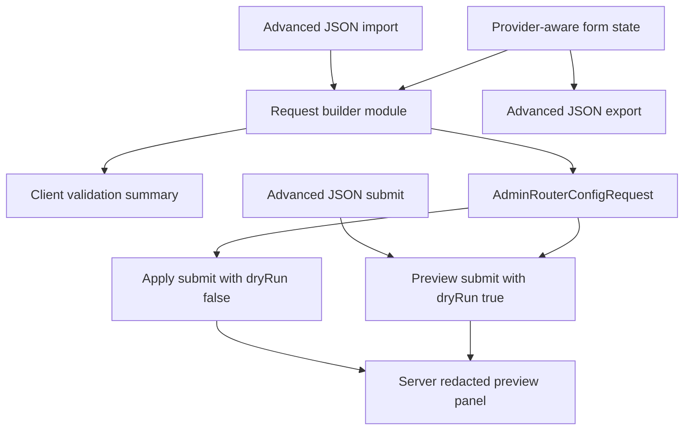

# feat: Replace LLM Router JSON editor with admin form

## Summary

Replace the LLM Router admin page's raw request JSON editor with a provider-aware form that builds the existing `POST /api/admin/config/router` body for OpenRouter, Azure, DashScope cosyvoice, StepFun, unspeech, and default aliases. Keep preview/apply as the safety gate and preserve an advanced JSON view as an escape hatch, not the default editing path.

---

## Problem Frame

The current LLM Router admin page exposes the backend request body directly as JSON. That matches the server contract but makes routine operator work brittle: admins must remember each slice kind's required fields, know which URLs are HTTP or WebSocket roots, and avoid mistakes around merge/reset and default aliases while handling plaintext provider keys.

The backend already owns validation, encryption, merge semantics, and redacted previews. This plan keeps that backend boundary intact and improves the admin UI so the common configuration flows are discoverable, structured, and reviewable before apply.

---

## Requirements

**Form Coverage**

- R1. The page must let admins compose every currently supported slice kind: `openrouter`, `azure`, `dashscope-cosyvoice`, `stepfun`, and `unspeech`.
- R2. The page must expose defaults for chat model, TTS model, and recommended TTS voices without requiring manual JSON editing.
- R3. The page must preserve `merge` versus `reset` mode as an explicit, visible choice before preview or apply.
- R4. The page must support multiple LLM/TTS slices in one request while keeping unspeech constrained to one slice.

**Safety And Review**

- R5. The UI must build the same `AdminRouterConfigRequest` shape the server validates today; the backend remains the source of truth for encryption and final validation.
- R6. Plaintext keys must stay in input state only long enough to submit; preview and apply panels must only show the server's redacted response.
- R7. Preview remains the primary review step and apply must be disabled while client-side required fields are incomplete.
- R8. Advanced JSON must remain available for inspection or emergency unsupported fields, but the default path must not require writing JSON.

**Operator Experience**

- R9. Provider-specific fields must be grouped and labeled by operational meaning, including endpoint defaults, key entry id, model alias, upstream model, region, and streaming settings.
- R10. The page must show a compact summary of pending slices, touched config keys, previewed changes, and last apply result.
- R11. The layout must stay usable on narrow admin viewports without overlapping controls or forcing JSON-editor-sized panes.

---

## Key Technical Decisions

- **Keep the backend route contract unchanged.** The form should compile UI state into `AdminRouterConfigRequest` and call `adminApi.applyRouterConfig` exactly as the JSON page does. This avoids duplicating encryption, merge, validation, and invalidation behavior in the browser.
- **Extract request-building logic into a pure UI module.** A small builder module should own form-state defaults, provider-kind projections, validation messages, and JSON import/export. This gives the risky payload conversion focused Vitest coverage without introducing component-test dependencies the admin app does not currently use.
- **Use existing admin and UI primitives.** Follow the Voice Pack form pattern with `@proj-airi/ui` primitives, `DatalistField`, global `.panel`/`.badge` styling, and Vue class arrays. Do not invent a separate mini design system for this one page.
- **Treat advanced JSON as a synchronized escape hatch.** The default view is the form. Advanced JSON can import into the form when it matches supported slice kinds, and export the current form payload for audit/debugging. Unsupported advanced edits should be previewable only through an explicit advanced-submit path so normal form state stays typed.
- **Do client-side validation for ergonomics, not authority.** Client checks should catch empty required fields, invalid URL schemes, duplicate unspeech slices, and missing defaults early. Server Valibot validation remains authoritative, and server errors still surface through the existing toast path.

---

## High-Level Technical Design

The form state is the primary editing model. The request builder is the single bridge from UI concepts to the server body. Preview and apply both use the same built payload so admins do not review one shape and apply another.

---

## Scope Boundaries

- This plan does not change `POST /api/admin/config/router`, its Valibot schemas, encryption behavior, configKV writes, or Redis invalidation.
- This plan does not add provider discovery, key health management, cost routing, or enable/disable controls. Those remain router operational follow-ups from the original router scope.
- This plan does not introduce a new component library or component-testing dependency. If implementation discovers component-level assertions are necessary, prefer a narrow repo-consistent mounting pattern before adding dependencies.
- This plan does not extend the public stage-web, stage-tamagotchi, or mobile app surfaces. `apps/ui-admin` is the admin surface; responsive behavior still needs narrow viewport verification.

---

## Implementation Units

### U1. Router config form state and request builder

- **Goal:** Define typed UI state, provider defaults, validation, import/export, and `AdminRouterConfigRequest` projection outside the Vue page.
- **Requirements:** R1, R2, R3, R4, R5, R6, R8, R9
- **Dependencies:** None
- **Files:**
  - `apps/ui-admin/src/modules/api.ts`
  - `apps/ui-admin/src/modules/router-config-form.ts`
  - `apps/ui-admin/src/modules/router-config-form.test.ts`
- **Approach:** Replace `Array<Record<string, unknown>>` for router slices with a discriminated union mirroring the admin route's existing slice kinds. Add form-facing state that can represent editable drafts, provider defaults, validation errors, and the compiled request payload. Keep plaintext keys out of previews and summaries.
- **Execution note:** Start with request-builder tests before replacing the page, because payload drift is the main regression risk.
- **Patterns to follow:** `apps/server/src/routes/admin/config/router/index.ts` for required fields and URL rules; `apps/server/src/services/domain/admin/router-config/index.ts` for default key entry ids and provider defaults; `apps/ui-admin/src/pages/VoicePackFormPage.vue` for form-state normalization.
- **Test scenarios:**
  - OpenRouter draft with model alias, override model, plaintext key, default base URL, and chat default compiles to one `openrouter` slice and `defaults.chatModel`.
  - Azure draft compiles region, default voice, key entry id, and TTS default without adding OpenRouter-only fields.
  - DashScope cosyvoice draft preserves `intl` versus `cn` region and upstream model.
  - StepFun draft defaults missing upstream model to the server-supported default only when the UI chooses to omit it, and preserves explicit instruction/default voice fields.
  - Unspeech REST-only draft compiles without `streaming`; unspeech streaming draft compiles WebSocket URL, key, models, and default model.
  - Validation reports missing required plaintext keys, invalid HTTP/WS URL schemes, empty aliases, and more than one unspeech draft.
  - Exported JSON round-trips through import for supported slice kinds and defaults.
- **Verification:** The builder produces server-schema-compatible payloads for every supported provider kind and reports client-side errors before page code submits.

### U2. Provider-aware LLM Router form UI

- **Goal:** Replace the raw textarea-first page with a form-first interface for adding, editing, duplicating, and removing router slices.
- **Requirements:** R1, R2, R3, R4, R7, R9, R11
- **Dependencies:** U1
- **Files:**
  - `apps/ui-admin/src/pages/LlmRouterPage.vue`
  - `apps/ui-admin/src/components/llm-router/RouterSliceEditor.vue`
  - `apps/ui-admin/src/components/llm-router/RouterDefaultsEditor.vue`
  - `apps/ui-admin/src/components/llm-router/RouterModeControl.vue`
  - `apps/ui-admin/src/pages/LlmRouterPage.test.ts`
  - `apps/ui-admin/src/modules/router-config-form.test.ts`
- **Approach:** Split the page into a main form column and an operations sidebar. Use a provider-kind selector to add slices, render provider-specific fields in compact panels, and keep defaults in their own section. Make reset mode visually distinct because it drops existing router models not included in the request.
- **Patterns to follow:** `apps/ui-admin/src/pages/FluxPage.vue` for preview/apply action flow; `apps/ui-admin/src/pages/VoicePackFormPage.vue` for `@proj-airi/ui` fields, status badges, `Callout`, and grouped class arrays; `docs/ai/context/ui-components.md` for primitive props.
- **Test scenarios:**
  - Empty page starts with a useful OpenRouter draft matching the current screenshot's common chat-default path.
  - Adding each provider kind shows only that provider's relevant fields.
  - Removing a slice updates validation and pending summary.
  - Reset mode displays a warning state while merge mode remains the normal path.
  - Apply and preview buttons are disabled while validation errors exist or a request is in flight.
  - Narrow viewport stacks form and sidebar without overlapping labels, buttons, or preview output.
- **Verification:** The form can create each provider kind, validation state updates as fields change, and the built request is identical to the builder output covered in U1.

### U3. Preview, apply, and advanced JSON workflow

- **Goal:** Preserve the existing dry-run/apply behavior while making preview output easier to scan and keeping JSON available as a controlled advanced path.
- **Requirements:** R5, R6, R7, R8, R10, R11
- **Dependencies:** U1, U2
- **Files:**
  - `apps/ui-admin/src/pages/LlmRouterPage.vue`
  - `apps/ui-admin/src/components/llm-router/RouterPreviewPanel.vue`
  - `apps/ui-admin/src/components/llm-router/RouterAdvancedJsonPanel.vue`
  - `apps/ui-admin/src/pages/LlmRouterPage.test.ts`
  - `apps/ui-admin/src/modules/router-config-form.test.ts`
- **Approach:** Submit built form payloads through `adminApi.applyRouterConfig`. Render `applied`, `invalidatedKeys`, and `preview` as separate scan-friendly sections before the raw JSON block. Add advanced JSON export/import and an explicit advanced preview/apply path for cases the typed form cannot represent yet.
- **Patterns to follow:** Existing `formatJson` panels in `LlmRouterPage.vue` and `FluxPage.vue`; server response shape in `apps/server/src/services/domain/admin/router-config/index.ts`.
- **Test scenarios:**
  - Preview sends `dryRun: true`, stores preview result, leaves last apply untouched, and renders invalidated keys as empty for dry run.
  - Apply sends `dryRun: false`, updates both preview and last apply state, and renders invalidated keys from the server.
  - Server validation errors surface through the existing toast path without clearing form input.
  - Preview panel never renders plaintext keys from form state.
  - Advanced JSON export matches the built form payload.
  - Advanced JSON import rejects non-object JSON and unsupported slice kind with actionable errors.
- **Verification:** Preview/apply calls use the same compiled payload, server errors preserve form state, and advanced JSON cannot silently diverge from the visible form without an explicit advanced action.

### U4. Admin styling, responsive polish, and verification notes

- **Goal:** Make the new form feel like a dense operations tool rather than a marketing page or raw schema editor.
- **Requirements:** R9, R10, R11
- **Dependencies:** U2, U3
- **Files:**
  - `apps/ui-admin/src/styles/main.css`
  - `apps/ui-admin/src/pages/LlmRouterPage.vue`
  - `docs/ai/context/ui-components.md` only if implementation changes `packages/ui` primitives
- **Approach:** Reuse existing admin panels, badges, buttons, and field styling. Add only page-specific layout classes if repeated class arrays become unreadable. Keep cards for individual slice editors and result panels, not nested decorative sections. Verify desktop and narrow viewport behavior after implementation.
- **Patterns to follow:** `apps/ui-admin/src/styles/main.css` for admin shell primitives; `VoicePackFormPage.vue` for responsive form density.
- **Test scenarios:**
  - Test expectation: none -- this unit is visual/layout polish; automated behavioral coverage lives in U1-U3.
- **Verification:** Use local admin app rendering to inspect the LLM Router page at desktop and narrow widths; confirm fields, buttons, badges, and preview panels remain readable and non-overlapping.

---

## Acceptance Examples

- AE1. Given an admin wants the screenshot's OpenRouter setup, when they fill chat model alias, upstream model, OpenRouter key, and base URL in the form, preview sends the same request shape the JSON editor previously contained and returns a redacted preview.
- AE2. Given an admin adds Azure, DashScope, StepFun, and unspeech entries in one merge request, when they preview, the pending summary lists each slice and the server response separates `LLM_ROUTER_CONFIG`, `UNSPEECH_UPSTREAM`, and default aliases.
- AE3. Given an admin selects reset mode, when they prepare to preview or apply, the UI displays reset as a destructive configuration mode and still requires a valid slice or defaults entry.
- AE4. Given the form contains a plaintext key, when preview or apply finishes, the page does not echo that key in summaries, JSON preview panels, or last apply panels.
- AE5. Given an unsupported future field is needed before the form catches up, when the admin opens advanced JSON, they can export the current payload, edit it, and submit through an explicit advanced path without corrupting normal typed form state.

---

## System-Wide Impact

| Surface | Impact |
|---|---|
| `apps/ui-admin` | Primary user-facing change; LLM Router page becomes form-first with typed request building. |
| `apps/server` | No planned runtime changes; route schemas and service builders remain the contract the UI mirrors. |
| ConfigKV / Redis invalidation | No behavior change; preview/apply still goes through the existing admin endpoint. |
| Public web, Electron, mobile | No direct product UI change; only admin app responsive behavior is in scope. |

---

## Risks & Dependencies

- **Schema drift risk:** The UI will mirror server slice fields. Mitigate by deriving names from current server route/service code during implementation and keeping request-builder tests focused on every provider kind.
- **Plaintext key handling risk:** Browser state necessarily contains keys before submit. Mitigate by never copying form keys into preview summaries, logs, or exported results unless the admin explicitly exports advanced JSON.
- **Advanced JSON ambiguity:** A JSON escape hatch can accidentally preserve the old complexity. Mitigate by keeping it collapsed/secondary and requiring explicit advanced submit for unsupported edits.
- **Testing gap:** `apps/ui-admin` currently has only module-level Vitest coverage. Mitigate with pure request-builder tests plus manual browser verification; add component tests only if implementation introduces behavior that cannot be covered through the builder.

---

## Sources & Research

- `apps/ui-admin/src/pages/LlmRouterPage.vue` currently owns the raw JSON textarea, preview, and apply flow.
- `apps/server/src/routes/admin/config/router/index.ts` defines the Valibot body schema and supported slice kinds.
- `apps/server/src/services/domain/admin/router-config/index.ts` defines provider defaults, request application semantics, redacted previews, and invalidated key behavior.
- `apps/ui-admin/src/pages/VoicePackFormPage.vue` shows the current admin form pattern with `@proj-airi/ui` primitives and responsive class arrays.
- `apps/ui-admin/src/pages/FluxPage.vue` shows the preview-first admin mutation pattern.
- `docs/ai/context/ui-components.md` documents the UI primitives to reuse if implementation touches shared components.
