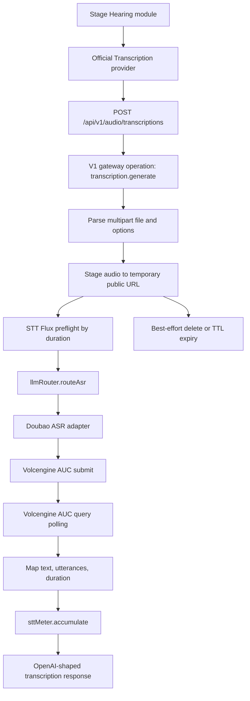
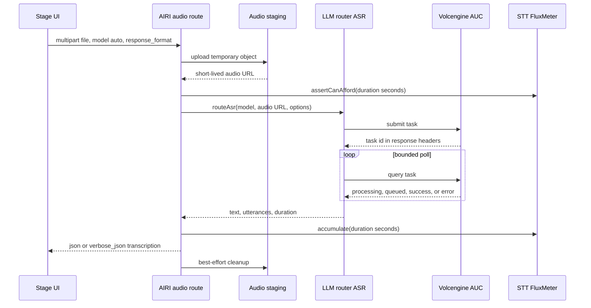

# feat: Add Doubao ASR gateway

## Summary

**Superseded direction as of 2026-06-14:** do not use Volcengine AUC as AIRI's primary realtime ASR path. AUC requires URL-based recorded-file submission and is unsuitable for low-latency Hearing. The current implementation direction is to ship an official server-side realtime ASR proxy first, starting with Aliyun NLS because AIRI already has a working streaming transcription executor, then revisit Doubao streaming ASR (`/api/v3/sauc/bigmodel_async`) as a follow-up.

Add server-side official recorded-file transcription for AIRI through Doubao/Volcengine ASR. The client uploads a recorded audio file to AIRI, AIRI authenticates the user, stages the audio behind a short-lived public URL because Volcengine AUC accepts audio URLs, submits and polls the standard AUC API, maps the result back to an OpenAI-shaped transcription response, and bills successful requests through a new STT FluxMeter debt ledger.

This plan intentionally does not add realtime streaming ASR, client-side BYOK credentials, or a multi-provider ASR pool. The first user-facing path is recorded audio file transcription through the existing Hearing module and a new Official Transcription provider.

---

## Problem Frame

AIRI already has official hosted chat and TTS providers, plus client-side transcription providers for OpenAI, OpenAI-compatible endpoints, Aliyun NLS streaming, browser Web Speech, CometAPI, MiMo, and local audio paths. It does not yet have an official AIRI-hosted ASR provider that lets normal signed-in users transcribe recordings without bringing their own ASR credentials.

The server also does not expose a mounted transcription route today. The current AIRI audio surface is `/api/v1/audio` with speech, voices, and speech model catalog routes. The OpenAI public route surface under `/api/v1/openai` is kept for actual OpenAI-compatible chat endpoints, so ASR should extend the AIRI audio surface rather than adding another extension under `/api/v1/openai`.

Volcengine's recorded-file ASR APIs are asynchronous and require an online audio URL in the submit body. That means AIRI can present a normal multipart file upload to its clients, but the server needs a transient audio staging boundary before it can call the Doubao ASR upstream.

---

## Requirements

**Product Behavior**

- R1. Signed-in AIRI users can choose an Official Transcription provider in the Hearing module and transcribe a recorded audio file without entering Volcengine credentials.
- R2. The client-facing endpoint accepts an OpenAI-shaped multipart transcription request with `file`, `model`, optional `language`, optional `response_format`, and optional provider options.
- R3. The first supported mode is recorded file transcription. Realtime streaming ASR, idle 24h batch jobs, and client BYOK credentials are out of scope for this version.
- R4. The endpoint returns `json` and best-effort `verbose_json` responses compatible with the existing Hearing confidence filter. When upstream utterances are available, map them to segments with confidence and timing where possible.

**Server Gateway**

- R5. The route lives under the AIRI audio surface as `POST /api/v1/audio/transcriptions`, not under `/api/v1/openai`.
- R6. The route uses the existing v1 gateway lifecycle: auth, session context, request id, operation middleware, config checks, product events, request logs, tracing, and metrics.
- R7. Server-managed Volcengine credentials, resource id, model name, endpoint, timeout, and retry/poll settings are configured through ConfigKV/admin surfaces. Client requests never include upstream provider keys.
- R8. AIRI stages uploaded audio to a temporary, externally reachable object URL before submitting to Volcengine AUC, then deletes or expires the object through a retention policy.
- R9. Raw audio bytes must not be written to logs, traces, product events, request logs, or metrics.

**Billing And Operations**

- R10. Successful transcription usage is billed through a new STT FluxMeter using audio duration seconds, not through minimum whole-request Flux billing.
- R11. The server performs a balance preflight before upstream spend using server-derived or server-verified audio duration metadata.
- R12. If the upstream never reaches a successful result within the synchronous poll budget, AIRI returns a clear gateway timeout/error response and does not bill the user for a successful transcription.
- R13. Admins can configure the Doubao ASR router slice and default ASR model through the existing router config admin workflow.

---

## Key Technical Decisions

- **Use AIRI's audio extension route.** Add `POST /api/v1/audio/transcriptions` beside `/api/v1/audio/speech`. This matches the current route split in `apps/server/src/routes/openai/v1/index.ts` where only actual OpenAI public endpoints stay under `/api/v1/openai`.
- **Use Volcengine standard AUC first.** The standard recorded-file API documented at `https://www.volcengine.com/docs/6561/1354868` has submit and query endpoints intended for normal recorded-file recognition. The idle variant at `https://www.volcengine.com/docs/6561/1840838` may complete within a 24h window, so it is not a good first fit for the synchronous Hearing settings test and recording workflow.
- **Expose a multipart upload to AIRI clients, stage URL internally.** The official Volcengine AUC contract requires an audio URL, so the AIRI route should hide that provider-specific detail from clients and own temporary object storage.
- **Extend `LLM_ROUTER_CONFIG` with ASR.** Add an `asr` slice beside existing `llm` and `tts` models instead of creating a separate router config key. This reuses envelope key encryption, config cache invalidation, admin preview/apply semantics, model defaults, and router ownership.
- **Add `routeAsr` rather than bypassing the router.** ASR should become a first-class gateway operation, e.g. `transcription.generate`, with its own adapter contract and metrics. This keeps chat, TTS, and ASR diagnostics consistent.
- **Use server-side duration for STT billing.** Preflight and final billing should use trusted duration derived by the server from uploaded audio metadata and/or upstream `audio_info.duration`. Do not trust a client-supplied duration for billing.
- **Prefer new-console `X-Api-Key` credentials for v1.** The standard AUC docs support `X-Api-Key`. Start there, with resource id configured per model, and defer old-console `X-Api-App-Key` plus `X-Api-Access-Key` support unless operations needs it.
- **Keep synchronous polling bounded.** The client-facing route should poll standard AUC up to a configurable budget suitable for short recordings. Long-running batch/idle jobs need a later job API or callback workflow.

---

## High-Level Technical Design

---

## Scope Boundaries

- In scope: server-side official recorded-file transcription, standard Volcengine AUC, authenticated AIRI audio route, temporary audio staging, STT Flux billing, admin configuration, shared Stage UI provider wiring, and docs/tests for those paths.
- Out of scope: realtime/streaming ASR, idle 24h batch mode, user-provided Volcengine credentials, ASR provider fallback pools, diarization UI, long-running job status APIs, webhook/callback processing, and client direct calls to Volcengine.
- Deferred follow-ups: idle batch transcription with background jobs, streaming ASR provider, multi-provider ASR routing, old-console Volcengine credential mode, advanced ASR options UI, and transcript persistence/history.

---

## Implementation Units

### U1. ASR config schema and router contract

- **Goal:** Make ASR a first-class router model kind beside LLM and TTS.
- **Requirements:** R5, R6, R7, R13
- **Dependencies:** None
- **Files:**
  - `apps/server/src/services/adapters/config-kv.ts`
  - `apps/server/src/services/domain/llm-router/config-loader.ts`
  - `apps/server/src/services/domain/llm-router/router.ts`
  - `apps/server/src/services/domain/llm-router/types.ts`
  - `apps/server/src/services/domain/llm-router/tests/router.test.ts`
- **Approach:** Extend `LLM_ROUTER_CONFIG` with an `asr.models` record. Add `asrProviderSchema` with a first provider value of `volcengine-asr`; use Doubao ASR as the user-facing/admin label. Add `DEFAULT_ASR_MODEL`, `FLUX_PER_MINUTE_STT`, and `STT_DEBT_TTL_SECONDS` ConfigKV entries. Add `routeAsr` and an `AsrRouteContext` that carries provider, model alias, upstream model/resource id, key entry id, timeout, and poll settings.
- **Execution note:** Update config validation tests before wiring the route, because schema drift here would break admin preview/apply and runtime loading.
- **Test scenarios:**
  - `LLM_ROUTER_CONFIG` accepts `llm`, `tts`, and `asr` records with independent model ids.
  - Missing `DEFAULT_ASR_MODEL` makes `model: "auto"` fail with `CONFIG_NOT_SET`.
  - `routeAsr` resolves model aliases, decrypts the configured key, and passes provider-specific adapter params without exposing ciphertext.
  - Router cache invalidation clears ASR config together with LLM/TTS config.
- **Verification:** Typecheck and router tests prove ASR config can be loaded, validated, cached, invalidated, and routed without changing chat/TTS behavior.

### U2. Doubao ASR adapter for Volcengine standard AUC

- **Goal:** Implement the upstream submit/query adapter for recorded-file recognition.
- **Requirements:** R3, R4, R7, R12
- **Dependencies:** U1
- **Files:**
  - `apps/server/src/services/adapters/asr/types.ts`
  - `apps/server/src/services/adapters/asr/volcengine.ts`
  - `apps/server/src/services/adapters/asr/index.ts`
  - `apps/server/src/services/adapters/asr/volcengine.test.ts`
  - `apps/server/src/services/domain/llm-router/router.ts`
- **Approach:** Add an adapter contract that accepts a staged `audioUrl`, file format, optional language, response format, upstream model name, and adapter params. Implement standard AUC submit/query using `https://openspeech.bytedance.com/api/v3/auc/bigmodel/submit` and `/query` by default, with endpoint overrides for tests and operations. Read status from the documented response headers and map success, processing, queued, silent audio, invalid request, empty audio, bad format, oversize, and busy states into AIRI gateway errors.
- **Execution note:** Unit tests should mock `fetch` and exercise both header-level task status and JSON body mapping. Do not include real audio bytes in fixtures.
- **Test scenarios:**
  - Submit sends `X-Api-Key`, resource id, request id, sequence header, model name, audio URL, and format.
  - Query maps success to `{ text, utterances, durationMs }`.
  - Processing/queued statuses continue polling until the poll budget ends.
  - Silent audio returns an empty or explicit silent transcription response according to route policy.
  - Invalid format, oversize, busy, and malformed upstream responses map to structured gateway errors with safe client messages and detailed server diagnostics.
- **Verification:** Adapter tests cover success, pending, timeout, and documented upstream error statuses without hitting Volcengine.

### U3. Temporary audio staging boundary

- **Goal:** Provide the short-lived public audio URL required by Volcengine without leaking raw upload handling into the route.
- **Requirements:** R8, R9, R11
- **Dependencies:** None, but this unit has an ops choice before implementation.
- **Files:**
  - `apps/server/src/services/domain/audio-staging/index.ts`
  - `apps/server/src/services/domain/audio-staging/index.test.ts`
  - `apps/server/src/app.ts`
  - `apps/server/src/services/adapters/config-kv.ts`
  - docs under `apps/server/docs/ai-context/`
- **Approach:** Add an `AudioStagingService` interface with `stage({ requestId, userId, file, contentType }) -> { url, objectKey, expiresAt }` and `cleanup(objectKey)`. Implement the first concrete backend only after choosing the deployment storage target. The repository does not currently show a server-side object storage/presigned URL boundary; `unstorage` appears only as a package dependency for `packages/stage-ui`, not as server upload infrastructure.
- **Implementation prerequisite:** Choose the temporary object storage backend and SDK/config shape before coding this unit. Candidate deployment-compatible backends are Volcengine TOS, S3-compatible object storage, or Cloudflare R2. The implementation must not pick a new storage dependency without user/ops confirmation.
- **Execution note:** Keep route code dependent only on the interface, so the selected storage backend is isolated to this unit.
- **Test scenarios:**
  - Staging rejects unsupported content types and files over configured size limits before upstream spend.
  - Staging returns a URL and expiry without logging raw bytes.
  - Cleanup runs on success, upstream error, route error, and timeout, while TTL expiry remains the safety net.
  - Object keys include request id or random entropy but do not expose user email, raw filename, or transcript content.
- **Verification:** Unit tests cover interface behavior with a fake backend; integration verification for the real backend is env-guarded and uses a tiny audio fixture.

### U4. Audio transcription route and domain service

- **Goal:** Add the authenticated AIRI route that accepts uploaded recordings and coordinates parsing, staging, routing, billing, tracing, and response mapping.
- **Requirements:** R1, R2, R4, R5, R6, R8, R9, R10, R11, R12
- **Dependencies:** U1, U2, U3
- **Files:**
  - `apps/server/src/routes/openai/v1/index.ts`
  - `apps/server/src/routes/openai/v1/gateway.ts`
  - `apps/server/src/routes/openai/v1/types.ts`
  - `apps/server/src/routes/openai/v1/operations/transcription-generation/index.ts`
  - `apps/server/src/services/domain/openai-transcription/index.ts`
  - `apps/server/src/routes/openai/v1/route.test.ts`
  - `apps/server/src/app.ts`
- **Approach:** Mirror the TTS service shape in `apps/server/src/services/domain/openai-speech/index.ts`. Parse multipart form data, resolve `model: "auto"` through `DEFAULT_ASR_MODEL`, stage the audio, derive trusted duration metadata for preflight, call `llmRouter.routeAsr`, map upstream result to OpenAI-style `json` or `verbose_json`, bill successful seconds through `sttMeter`, and emit request logs/product events/metrics. Add a route-specific upload limit so the global 1 MB body limit in `app.ts` does not silently reject normal audio files.
- **Execution note:** If reliable duration extraction requires a new dependency, pause for the storage/duration library decision rather than trusting client-provided duration.
- **Test scenarios:**
  - Authenticated multipart request with `model=auto` routes to `DEFAULT_ASR_MODEL` and returns `{ text }`.
  - `verbose_json` request maps upstream utterances into segments and sets duration.
  - Missing file, unsupported content type, oversized file, missing config, and insufficient balance return safe structured errors.
  - Upstream timeout returns a gateway timeout without calling `sttMeter.accumulate`.
  - Successful transcription calls `sttMeter.accumulate` with ceil seconds derived from trusted duration.
  - Cleanup is attempted for success and failure paths.
- **Verification:** Route tests cover request parsing, config resolution, billing, timeout, and response shape through mocked staging/router services.

### U5. STT billing, tracing, metrics, and request logs

- **Goal:** Add ASR-specific observability and usage accounting consistent with chat and TTS.
- **Requirements:** R6, R9, R10, R11, R12
- **Dependencies:** U4
- **Files:**
  - `apps/server/src/app.ts`
  - `apps/server/src/services/domain/billing/flux-meter.ts`
  - `apps/server/src/services/domain/llm-tracing/index.ts`
  - `apps/server/src/services/domain/product-events.ts`
  - `apps/server/src/utils/observability.ts`
  - `apps/server/docs/ai-context/flux-meter.md`
  - `apps/server/docs/ai-context/observability-conventions.md`
- **Approach:** Instantiate `sttMeter` with `service: "stt"`, `FLUX_PER_MINUTE_STT`, and `STT_DEBT_TTL_SECONDS`. Add tracing helpers such as `startTranscriptionGeneration` and OTel operation labels for `transcription.generate`. Record low-cardinality metrics by operation, provider, model, status, and duration bucket. Request/product logs can include request id, provider, model, file metadata, duration seconds, and status, but not raw audio or full transcript unless a deliberate transcript logging policy is added later.
- **Execution note:** Avoid adding transcript text to traces by default. A transcript can contain sensitive user speech and should be treated differently from bounded diagnostic snippets.
- **Test scenarios:**
  - STT debt accumulation behaves like TTS dust billing but uses seconds/minutes instead of characters.
  - Successful route logs include duration seconds and Flux consumed.
  - Failed and timed-out route logs include provider/status/error code without raw audio or transcript text.
  - Metrics projections exclude request id, user id, raw file names, and transcript text.
- **Verification:** Existing billing tests plus new STT service tests prove sub-Flux debt accounting and safe observability projections.

### U6. Admin router config support for ASR

- **Goal:** Let operators configure Doubao ASR without editing raw ConfigKV JSON by hand.
- **Requirements:** R7, R13
- **Dependencies:** U1
- **Files:**
  - `apps/server/src/routes/admin/config/router/index.ts`
  - `apps/server/src/services/domain/admin/router-config/index.ts`
  - `apps/server/src/services/domain/admin/router-config/index.test.ts`
  - `apps/ui-admin/src/modules/api.ts`
  - `apps/ui-admin/src/modules/router-config-form.ts`
  - `apps/ui-admin/src/modules/router-config-form.test.ts`
  - `apps/ui-admin/src/components/llm-router/RouterSliceEditor.vue`
- **Approach:** Add an ASR slice kind `volcengine-asr` labeled as Doubao ASR in the admin UI. It compiles to `LLM_ROUTER_CONFIG.asr.models[modelName]`. Expose fields for model alias, upstream model name, resource id, endpoint overrides, API key, key entry id, timeout/poll settings, and default ASR model. Preserve the existing preview/apply/redaction flow.
- **Execution note:** Keep credential redaction server-owned. The UI should never render plaintext API keys after submit.
- **Test scenarios:**
  - Admin request with one ASR slice creates encrypted key entries and an ASR model config.
  - Preview redacts ASR keys and lists `LLM_ROUTER_CONFIG` plus `DEFAULT_ASR_MODEL` as touched keys.
  - Reset/merge semantics preserve existing LLM/TTS config according to the current admin route behavior.
  - UI builder exports/imports an ASR slice and validates missing API key, missing resource id, and invalid endpoints.
- **Verification:** Server and UI admin tests show ASR config round-trips through preview/apply without regressing existing LLM/TTS slices.

### U7. Stage UI Official Transcription provider

- **Goal:** Surface the server-side ASR route as the official provider for the Hearing module across web, Electron, and mobile shared Stage UI.
- **Requirements:** R1, R2, R3, R4
- **Dependencies:** U4
- **Files:**
  - `packages/stage-ui/src/libs/providers/providers/official/index.ts`
  - `packages/stage-ui/src/libs/providers/providers/official/shared.ts`
  - `packages/stage-ui/src/composables/use-auth-provider-sync.ts`
  - `packages/stage-ui/src/stores/providers.ts`
  - `packages/stage-pages/src/pages/settings/providers/transcription/official-provider-transcription.vue`
  - `packages/i18n/src/locales/*/settings.yaml`
  - `packages/stage-ui/src/libs/providers/providers/official/index.test.ts`
  - `packages/stage-ui/src/stores/modules/hearing.test.ts`
- **Approach:** Add `OFFICIAL_TRANSCRIPTION_PROVIDER_ID` and `providerOfficialTranscription` using `createOfficialAudioProvider()` plus `withCredentials()`. Ensure the provider's transcription method posts through the existing `@xsai/generate-transcription` flow to `/api/v1/audio/transcriptions`. Add it to auth provider sync for the `hearing` module and provide `auto` model discovery if the server exposes an ASR model catalog, or a static `auto` model if it does not. Add a simple provider settings page with the existing transcription playground and no credential fields.
- **Execution note:** The existing i18n files already contain official transcription title/description strings in at least English; verify all locales touched by provider metadata and fill missing keys centrally.
- **Test scenarios:**
  - Signed-in auth sync activates official transcription for Hearing when no hearing provider is set.
  - Official transcription provider injects bearer token and `x-airi-session-id`.
  - A recording file uses the existing Hearing `transcribeForRecording` path and requests `model: "auto"`.
  - `verbose_json` confidence filtering works when the server returns segments and produces the current unsupported warning when it does not.
- **Verification:** Stage UI unit tests cover provider config/auth and Hearing integration. Manual endpoint checks should include stage-web/shared Stage UI, Electron/Tamagotchi, and mobile-responsive settings screens.

### U8. Documentation and verification matrix

- **Goal:** Keep server docs and operational docs aligned with the new ASR surface.
- **Requirements:** R3, R5, R7, R8, R9, R10, R11, R12, R13
- **Dependencies:** U1-U7
- **Files:**
  - `apps/server/docs/ai-context/architecture-overview.md`
  - `apps/server/docs/ai-context/transport-and-routes.md`
  - `apps/server/docs/ai-context/flux-meter.md`
  - `apps/server/docs/ai-context/observability-conventions.md`
  - `apps/server/docs/ai-context/verifications/doubao-asr.md`
- **Approach:** Update stale audio route documentation, record the new `/api/v1/audio/transcriptions` surface, document the temporary audio staging requirement, and add an env-guarded verification note for real Volcengine AUC tests.
- **Execution note:** Fix existing references that still mention `/api/v1/openai/audio/speech` while editing audio route docs.
- **Test scenarios:** None; this unit is documentation, but it should point to the concrete automated and env-guarded verification commands.
- **Verification:** Docs state the current route topology, config keys, billing units, privacy rules, and live-test prerequisites.

---

## Acceptance Examples

- AE1. Given a signed-in user with no hearing provider selected, when AIRI auth sync runs after login, the Hearing module selects Official Transcription with model `auto`.
- AE2. Given a short WAV recording, when the user runs the Hearing settings transcription test, the client posts multipart audio to `/api/v1/audio/transcriptions`, AIRI stages it, Doubao returns text, and the UI displays the transcript.
- AE3. Given the user enables confidence filtering, when Doubao returns utterances, AIRI maps them into `verbose_json` segments so low-confidence text can be filtered by the existing Hearing store.
- AE4. Given the user's balance cannot cover the server-derived audio duration, when they submit a recording, AIRI rejects the request before calling Volcengine.
- AE5. Given Volcengine stays queued/processing beyond the synchronous poll budget, when AIRI times out, the response is a safe gateway timeout, no successful STT billing is recorded, and the staged object is cleaned up or left to TTL expiry.
- AE6. Given an admin previews a Doubao ASR slice, when the server returns the redacted preview, the API key is not visible and touched keys include `LLM_ROUTER_CONFIG` and `DEFAULT_ASR_MODEL`.

---

## System-Wide Impact

| Surface | Impact |
|---|---|
| `apps/server` routes | Adds `POST /api/v1/audio/transcriptions` and operation `transcription.generate`; route-specific upload limit must avoid the current global 1 MB body limit problem. |
| `apps/server` router/config | Extends `LLM_ROUTER_CONFIG` with `asr`, adds ASR model defaults and adapter params. |
| Billing | Adds `sttMeter` using seconds/minutes and a sub-Flux debt ledger, parallel to TTS chars. |
| Observability | Adds ASR tracing, metrics, request logs, and product events without raw audio or transcript text by default. |
| Admin | Adds ASR slice support to router config preview/apply and UI builder modules. |
| Stage UI | Adds official transcription provider reused by stage-web, stage-tamagotchi/Electron, and stage-pocket/mobile through shared provider wiring. |
| Infrastructure | Requires temporary object storage with externally reachable URLs and a deletion/TTL policy. |

---

## Risks And Dependencies

- **Temporary storage is a real dependency.** The repo does not currently expose a server-side object storage or presigned URL service. Implementation needs an explicit backend choice before U3 can be completed.
- **Volcengine AUC is async.** A synchronous AIRI endpoint can time out even after upstream accepts the task. This is acceptable for short recordings but not for long batch transcription; batch needs a later job API.
- **Preflight billing depends on trusted duration.** Billing should not trust client duration. If existing server code cannot derive audio duration, implementation must choose a duration extraction strategy before upstream spend.
- **Provider cost can occur before success.** On timeout, AIRI may have spent upstream quota without a successful client response. Keep the poll budget and file duration limits conservative for v1.
- **Audio privacy matters.** Temporary objects must expire quickly, object keys must not expose user data, logs must not include raw audio or transcripts, and cleanup must run on all route exits.
- **Route body limits need care.** The current global server body limit is too small for normal audio uploads. The route needs explicit multipart handling and upload limits so failures are intentional and explainable.
- **Credential/resource id mismatch is easy.** Volcengine standard AUC supports different resource ids for model versions. Admin validation and docs should make `volc.seedasr.auc` versus `volc.bigasr.auc` explicit.

---

## Open Questions

- Which temporary object storage backend should AIRI use for ASR audio staging in production: Volcengine TOS, S3-compatible storage, Cloudflare R2, or an existing internal upload service not present in this repo?
- Should v1 support only new-console `X-Api-Key`, or must it also support old-console `X-Api-App-Key` plus `X-Api-Access-Key` credentials?
- What should the initial synchronous poll budget and maximum accepted recording duration be for stage settings tests and normal Hearing usage?
- Which server-side duration extraction strategy is acceptable for preflight billing if no existing duration parser is available?
- Should transcript text be excluded from all server-side logs/traces by default, or should there be an explicit debug-only redacted transcript policy?

---

## Sources And Research

- `apps/server/src/routes/openai/v1/index.ts` defines the current route split: `/api/v1/openai` for OpenAI chat and `/api/v1/audio` for AIRI audio extensions.
- `apps/server/src/routes/openai/v1/gateway.ts` currently lists `chat.completions` and `speech.generate`; ASR needs a new operation.
- `apps/server/src/services/domain/openai-speech/index.ts` is the closest domain-service pattern for routing, tracing, billing, request logs, product events, and metrics.
- `apps/server/src/services/adapters/config-kv.ts` owns `LLM_ROUTER_CONFIG`, `DEFAULT_TTS_MODEL`, and TTS billing config; ASR config belongs near these definitions.
- `apps/server/docs/ai-context/flux-meter.md` and `apps/server/docs/ai-context/billing-architecture.md` already describe STT as a sub-Flux service category.
- `packages/stage-ui/src/stores/modules/hearing.ts` uses `@xsai/generate-transcription` for file-based transcription and already handles `json`/`verbose_json`.
- `packages/stage-ui/src/libs/providers/providers/official/index.ts` and `shared.ts` show how official providers attach AIRI auth and use `/api/v1/audio`.
- `packages/stage-ui/src/composables/use-auth-provider-sync.ts` is the auth-driven provider activation point that needs Hearing support.
- Volcengine standard recorded-file ASR docs: `https://www.volcengine.com/docs/6561/1354868`
- Volcengine idle recorded-file ASR docs: `https://www.volcengine.com/docs/6561/1840838`
